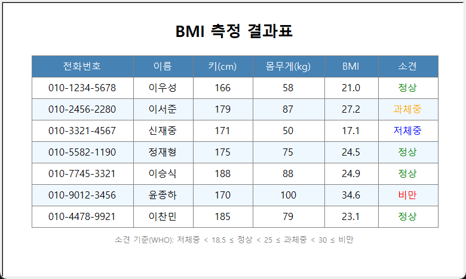

# HW01 BMI 계산 결과표 (Turtle GUI)

## 1. 팀 소개

- 팀명: 3조
- 팀장: (이찬민 / 202611838) — GitHub: [dopar07](https://github.com/dopar07)
- 팀원: (이우성 / 202611836)
- 팀원: (신재중 / 202611826)
- 팀원: (이서준 / 202611833)
## 2. 문제

전화번호, 이름, 키(cm), 몸무게(kg)로 구성된 `health.txt` 파일을 읽어 각 사람의 BMI를 계산하고,
그 결과를 **Turtle을 사용한 그래픽 표**로 화면에 출력하는 GUI 프로그램을 작성한다.

입력 파일 형식 (첫 줄은 제목, 데이터 줄 수는 임의):

```
전화번호 이름 키(cm) 몸무게(kg)
010-1234-5678 이우성 166 58
...
```

출력 표 항목: `전화번호 | 이름 | 키(cm) | 몸무게(kg) | BMI | 소견`

## 3. 설계

### 처리 흐름

```
health.txt ──▶ read_health_file() ──▶ 레코드 목록 ──▶ draw_table() ──▶ Turtle 창
                 │ 줄 단위 파싱                         │ 배경/격자/글자
                 │ calculate_bmi()                      │ 소견별 색상
                 └ bmi_category()
```

### BMI 계산 및 소견 기준

- BMI = 몸무게(kg) ÷ 키(m)²  (파일의 키는 cm 이므로 100으로 나누어 m로 변환)
- 소견 기준 (WHO)

| BMI | 소견 |
|---|---|
| 18.5 미만 | 저체중 |
| 18.5 이상 ~ 25 미만 | 정상 |
| 25 이상 ~ 30 미만 | 과체중 |
| 30 이상 | 비만 |

### 설계 시 고려한 점

- **데이터 개수가 달라져도 동작**: 줄 수만큼 행을 그리고, 창 높이도 행 수에 맞춰 자동으로 계산한다.
- **잘못된 입력 처리**: 빈 줄은 무시하고, 항목 수가 4개가 아니거나 키/몸무게가 숫자가 아닌 줄은 경고를 출력한 뒤 건너뛴다.
- **파일 인코딩**: UTF-8로 먼저 읽고, 실패하면 윈도우 메모장 기본(CP949)으로 다시 읽는다.
- **빠른 출력**: `screen.tracer(0)`으로 애니메이션을 끄고 한 번에 그린 뒤 `update()`한다.
- **고해상도 화면 대응**: 글꼴 크기를 픽셀 단위(음수 크기)로 지정해 윈도우 화면 배율(125%, 150%)에서도 글자가 칸을 넘치지 않는다.
- **가독성**: 헤더는 색 배경 + 흰 글씨, 데이터 행은 줄무늬 배경, 소견은 값에 따라 색을 다르게 표시한다.

## 4. 파일 내용 설명

| 파일 | 설명 |
|---|---|
| `bmi.py` | BMI 계산(`calculate_bmi`), 소견 판정(`bmi_category`), 파일 읽기(`read_health_file`) 함수와 테스트 함수(`test_bmi`) |
| `bmi_table.py` | 프로그램 실행 파일. `health.txt`를 읽어 Turtle로 표를 그린다 |
| `health.txt` | 입력 데이터 (전화번호, 이름, 키, 몸무게) |
| `result.png` | 실행 결과 화면 캡처 |

### 주요 함수

`bmi.py`
- `calculate_bmi()` : 몸무게(kg)와 키(cm)로 BMI를 계산한다.
- `bmi_category()` : BMI 값으로 소견(저체중/정상/과체중/비만)을 정한다.
- `read_health_file()` : `health.txt`를 읽어 사람별 `[전화번호, 이름, 키, 몸무게, BMI, 소견]` 리스트를 만든다.

`bmi_table.py`
- `draw_rect()` : 왼쪽 위 꼭짓점과 가로/세로 길이로 색칠된 사각형(칸)을 그린다.
- `write_text()` : 칸의 가운데에 글자를 쓴다.
- `draw_row()` : 칸을 옆으로 이어 그려 표의 한 줄을 만든다.
- `category_color()` : 소견에 따라 글자 색을 정한다.
- `fmt_number()` : `175.0` 같은 값을 `175`로 보기 좋게 바꾼다.
- `draw_table()` : 제목, 헤더 줄, 데이터 줄(줄무늬), 범례 순서로 표 전체를 그린다.

## 5. 실행 방법

```bash
cd homework/hw001
python bmi.py                 # BMI 함수 테스트
python bmi_table.py           # 표 출력 (창을 닫으면 종료)
```

## 6. 실행 결과



## 7. 역할 분담

| 이름 | 역할 |
|---|---|
| (이찬민) | 팀장. 전체 설계(함수 나누기), `bmi_table.py`의 `draw_table()`·`main()` 작성, GitHub 관리 및 제출 |
| (이우성) | `bmi.py`의 `calculate_bmi()`·`bmi_category()`·`read_health_file()` 작성, `test_bmi()` 테스트, `health.txt` 데이터 작성 |
| (신재중) | `bmi_table.py`의 `draw_rect()`·`write_text()`·`draw_row()` 작성, 실행 결과 화면 캡처 |
| (이서준) | `category_color()` 작성, 보고서(README.md) 작성 및 정리 |

## 8. 소감

- (이찬민) 처음에는 한 파일에 모든 코드를 넣으려고 했는데 기능별로 함수를 나누니 어디서 무엇을 하는지 한눈에 보여서 수정하기가 훨씬 쉬웠다. 글씨의 색을 넣는 함수를 이번 기회를 통해 새로 배워서 좋은 경험이었다. 팀장으로서 역할을 나누고 GitHub에 합치는 과정도 좋은 경험이었다.
- (이우성) BMI 공식은 간단했지만 키를 cm에서 m로 바꾸는 것을 빠뜨리면 값이 완전히 달라져서 테스트 함수의 중요성을 느꼈다. 파일을 한 줄씩 읽어 `split()`으로 나누는 방법을 익혔다.
- (신재중) Turtle로 표를 그릴 때 좌표 계산이 가장 어려웠다. 칸 하나를 그리는 함수를 먼저 만들고 그것을 반복해서 한 줄, 표 전체를 만드니 문제를 작게 나누는 방법을 배울 수 있었다.
- (이서준) 소견에 따라 글자 색을 바꾸는 함수를 만들면서 `if`/`elif`를 활용해 보았다. 보고서를 쓰면서 우리 코드가 어떤 순서로 동작하는지 다시 정리할 수 있어서 이해에 도움이 되었다.
